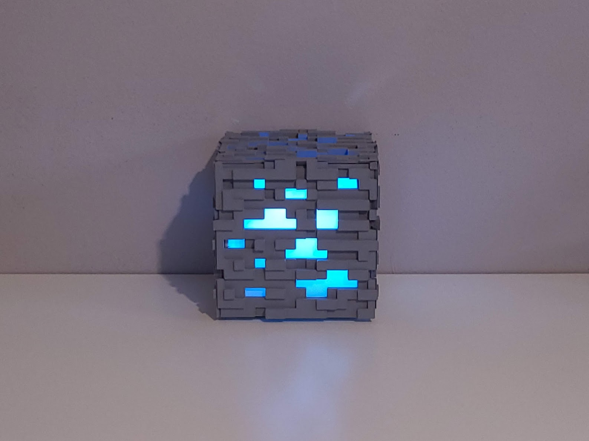

# ore-block-server
A Hobbyist Raspberry Pi Ubuntu server hosting a multiplayer Minecraft server and Discord music bot all enclosed in a 3D-printed Minecraft Ore Block with player-count activated lights, solar-illuminance regulated brightness, and CPU temperature-controlled fan speed.

    <a href="https://github.com/agilbert28/ore-block-server">
        

 
 This work is licensed under a <a rel="license" href="http://creativecommons.org/licenses/by/4.0/">Creative Commons Attribution 4.0 International License</a>.
